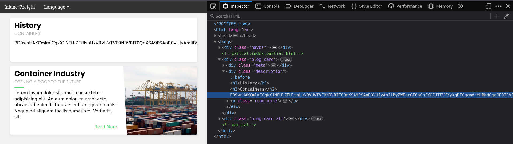
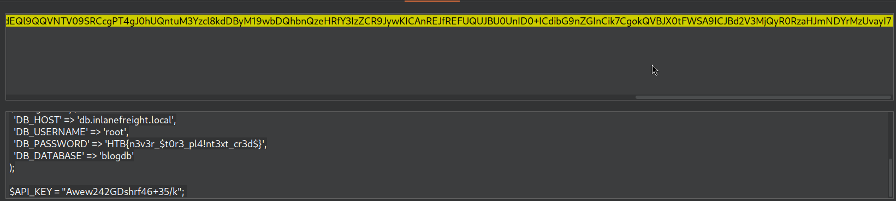

# LFI - PHP Filter Wrapper Abuse

## Lab Overview

This lab focused on exploiting a **Local File Inclusion (LFI)** vulnerability using **PHP Filters**.

Main learning point:

Sometimes included files are **executed by the server instead of displayed**.  
Because of this, sensitive source code may not appear in the response.

Using PHP filters allows reading the raw file content safely by converting it into Base64.

---

# What is LFI?

Local File Inclusion occurs when user input is used to include files on the server.

Example:

```php
include($_GET['language']);
```

If unsafely implemented, attackers can load arbitrary local files.

Example attack:

```text
/index.php?language=/etc/passwd
```

---

# Problem During Exploitation

When targeting PHP files like:

```text
config.php
```

the server usually:

1. Executes the PHP code
2. Sends only rendered output
3. Hides the actual source code

Example:

```php
<?php
$password = "root123";
?>
```

The browser will NOT display the code because PHP executes server-side.

So attackers need a way to read the file as plain text instead of executing it.

---

# PHP Filter Wrapper

PHP provides wrappers like:

```text
php://
```

These wrappers interact with internal PHP streams and filters.

Useful wrapper for LFI:

```text
php://filter
```

This allows transforming file content before it is returned.

---

# Why Use Base64 Encoding?

Directly including PHP files causes execution.

Using:

```text
convert.base64-encode
```

forces PHP to:

1. Read raw file content
2. Convert it into Base64 text
3. Return encoded content to browser
4. Prevent PHP execution

This exposes the actual source code safely.

---

# Exploitation Steps

## 1. Fuzz Existing Files

Used FFUF to discover valid files.

```bash
ffuf -w /seclists/Discovery/Web-Content/Durbuster-list-2.3-small.txt:FUZZ \
-u http://<SERVER_IP>:<PORT>/FUZZ.php
```

Discovered:

```text
configure.php
```

---

## 2. Abuse PHP Filter

Payload used:

```text
http://<SERVER_IP>:<PORT>/index.php?language=php://filter/read=convert.base64-encode/resource=configure
```


---

# Payload Breakdown

## `php://`

Access PHP stream wrappers.

---

## `filter`

Apply transformation filters to file content.

---

## `read=`

Specifies filter operation while reading the file.

---

## `convert.base64-encode`

Converts raw file contents into Base64.

Important because:

- PHP code is no longer executed
- Source code becomes visible
- Binary/special characters are handled safely

---

## `resource=configure`

Target file to read.

Equivalent to:

```text
configure.php
```

---

# What Happens Internally?

Without filter:

```text
include(configure.php)
```

PHP executes the file.

Result:

```text
Rendered output only
```

---

With filter:

```text
read file → encode base64 → return text
```

PHP treats file as data instead of executable code.

Result:

```text
PD9waHAgJHBhc3N3b3JkID0gInJvb3QxMjMiOz8+
```

---

# Final Step

Decoded the Base64 output:

```bash
echo "BASE64_DATA" | base64 -d
```

Recovered:

- Sensitive source code
- Credentials
- Flag

---

# Key Learnings

- LFI can expose sensitive server files
- PHP wrappers greatly extend LFI impact
- PHP files are usually executed, not displayed
- Base64 encoding helps read raw source safely
- `php://filter` is extremely common in real-world PHP exploitation

---

# Important Notes

This technique is not limited to PHP source files.

Base64 encoding is useful whenever:

- File content breaks rendering
- Binary data exists
- Execution prevents viewing raw source
- Special characters corrupt response

---

# Security Impact

Successful exploitation may expose:

- Database credentials
- API keys
- Internal application logic
- Authentication secrets
- Source code disclosure

Which can later lead to:

- Authentication bypass
- Remote Code Execution (RCE)
- Full server compromise


